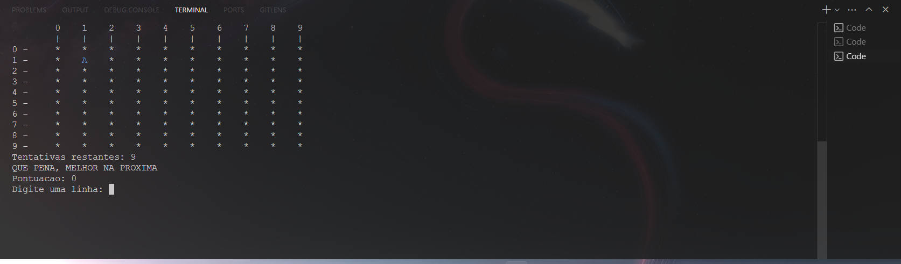
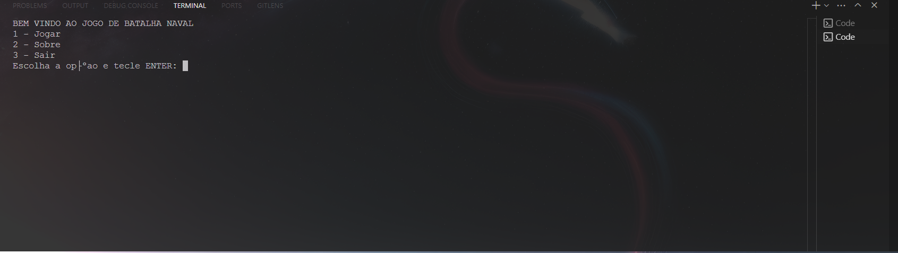
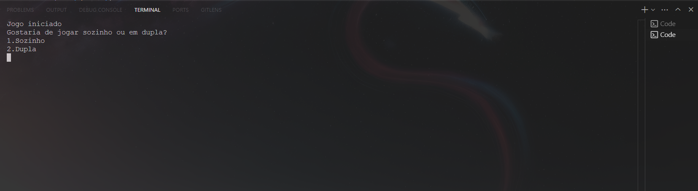
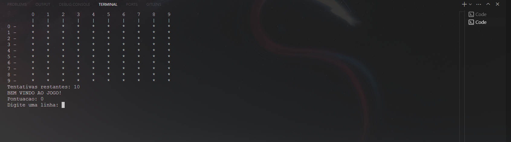
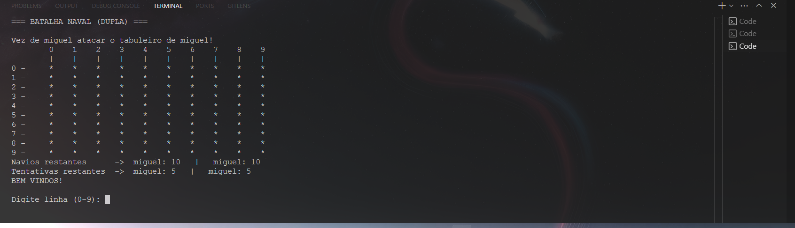

# 🚢 BATALHA NAVAL - Projeto em C++

> Jogo clássico de Batalha Naval feito em C++ com interface no terminal, lógica estruturada, controle de pontuação, modo solo e multiplayer local.

## 📌 Sobre o Projeto

Este projeto é uma implementação do jogo **Batalha Naval**, desenvolvida como exercício prático para reforçar conceitos de programação em C++ como:

- Estruturas condicionais e de repetição
- Manipulação de vetores bidimensionais
- Modularização de funções
- Interação com o usuário via terminal
- Lógica de jogo e estrutura de menus

---

## 🎮 Funcionalidades

- Menu principal com opções para jogar, ver créditos e sair
- Modo de jogo solo (contra o gabarito)
- Modo de jogo em dupla (turnos alternados entre jogadores)
- Tabuleiro 10x10 com máscara para ocultar navios
- Sistema de pontuação e mensagens personalizadas
- Controle de tentativas restantes
- Opção de reinício após o término da partida

---

## 🧠 Habilidades Aplicadas

| Conceito                   | Aplicação no Projeto                                 |
|----------------------------|------------------------------------------------------|
| `Modularização`            | Separação em funções como `jogarsosinho()`, `pontuacao()` etc. |
| `Vetores Bidimensionais`   | Representação do tabuleiro e da máscara dos navios   |
| `Ponteiros e Referência`   | Passagem por referência de variáveis de controle     |
| `Randomização (srand)`     | Controle de tempo para geração pseudoaleatória       |
| `Switch-case / Loops`      | Menu principal e navegação no jogo                   |
| `Controle de fluxo`        | Validação de entradas e reinício de jogo             |

---

## 🖼️ Demonstrações

### Menu Inicial

### Escolha de modo

### Tabuleiro e Tentativas

### Modo Dupla

---

## 👤 Autor

**Miguel de Castilho Gengo**  
Estudante de Engenharia de Computação (PUC-Campinas) • Dev C/Java/Python • Robótica & Cibersegurança

**Links**
- GitHub: [@Gengo250](https://github.com/Gengo250)
- LinkedIn: [miguel-gengo-8157b72a1](https://www.linkedin.com/in/miguel-gengo-8157b72a1)
- E-mail: [miguelgengo28@gmail.com](mailto:miguelgengo28@gmail.com)

Se este setup te ajudou, deixa uma ⭐ no repositório e sinta-se à vontade para abrir uma *Issue* com sugestões.